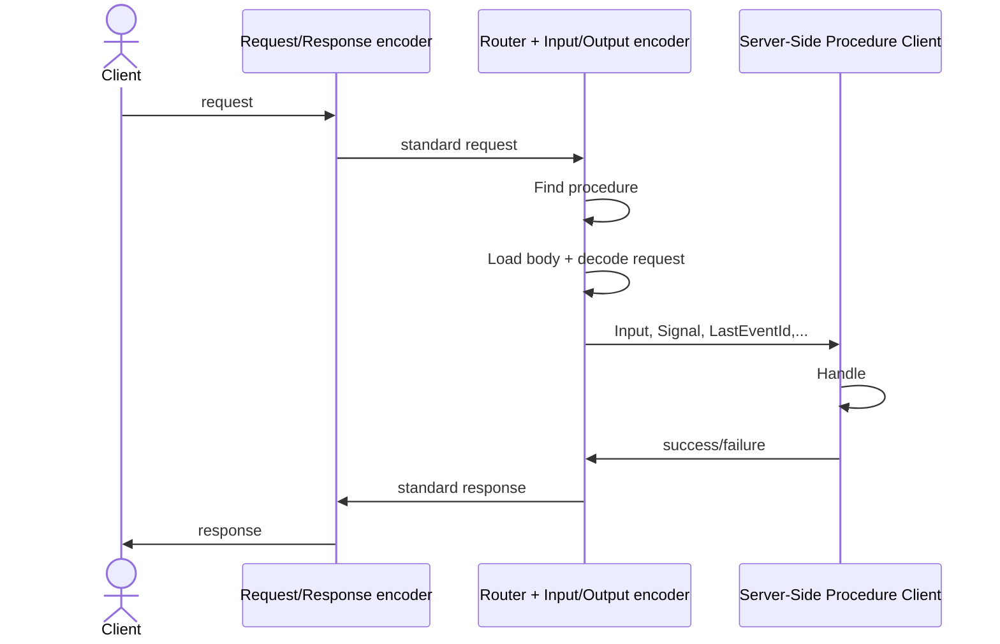

# RPC Handler

`RPCHandler` enables communication with clients over oRPC's proprietary [RPC protocol](/docs/advanced/rpc-protocol).

> Designed exclusively for [RPCLink](/docs/client/rpc-link). Avoid sending requests manually.

## Supported Data Types

* **string**, **number** (including `NaN`)
* **boolean**, **null**, **undefined**
* **Date** (including `Invalid Date`)
* **BigInt**, **RegExp**, **URL**
* **Record (object)**, **Array**
* **Set**, **Map**
* **Blob** (unsupported in `AsyncIteratorObject`)
* **File** (unsupported in `AsyncIteratorObject`)
* **AsyncIteratorObject** (only at root level; powers [Event Iterator](/docs/event-iterator))

## Setup

```ts
import { RPCHandler } from '@orpc/server/fetch'
import { CORSPlugin } from '@orpc/server/plugins'
import { onError } from '@orpc/server'

const handler = new RPCHandler(router, {
  plugins: [new CORSPlugin()],
  interceptors: [onError(e => console.error(e))],
})

export default async function fetch(request: Request) {
  const { matched, response } = await handler.handle(request, {
    prefix: '/rpc',
    context: {}
  })

  if (matched) return response
  return new Response('Not Found', { status: 404 })
}
```

## Filtering Procedures

```ts
const handler = new RPCHandler(router, {
  filter: ({ contract, path }) => !contract['~orpc'].route.tags?.includes('internal'),
})
```

## Default Plugins

| Plugin                                                   | Applies To                          | Toggle Option                  |
| -------------------------------------------------------- | ----------------------------------- | ------------------------------ |
| [StrictGetMethodPlugin](/docs/plugins/strict-get-method) | HTTP Adapter                        | `strictGetMethodPluginEnabled` |

## Lifecycle



Interceptors can intercept and modify the lifecycle at various stages.
