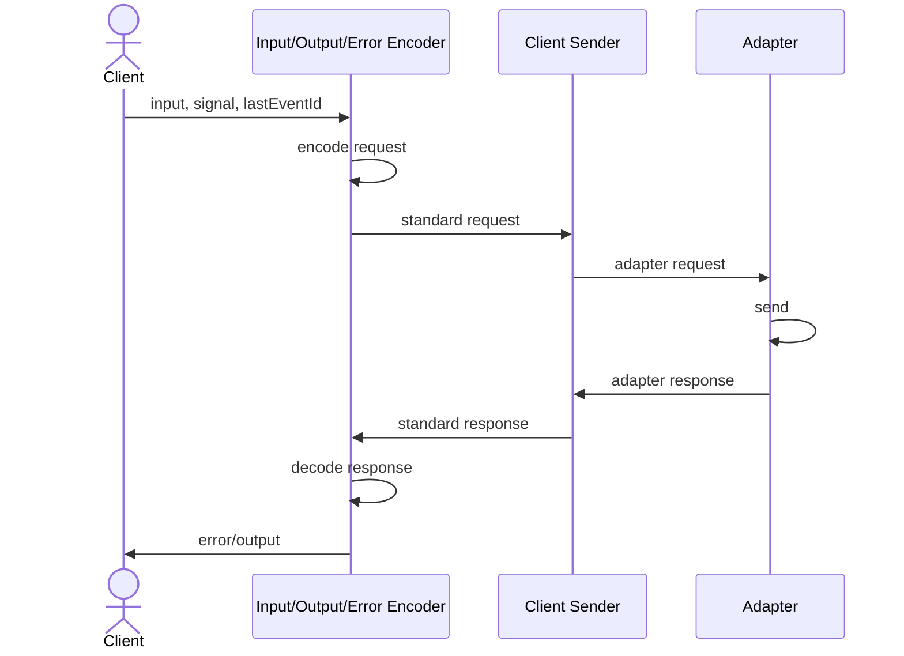

# RPCLink

Enables communication with [RPCHandler](/docs/rpc-handler) or any API following the [RPC Protocol](/docs/advanced/rpc-protocol) using HTTP/Fetch.

## Overview

```ts
import { onError } from '@orpc/client'
import { RPCLink } from '@orpc/client/fetch'

const link = new RPCLink({
  url: 'http://localhost:3000/rpc',
  headers: () => ({ 'x-api-key': 'my-api-key' }),
  fetch: (request, init) => {
    return globalThis.fetch(request, {
      ...init,
      credentials: 'include',
    })
  },
  interceptors: [onError(e => console.error(e))],
})

export const client: RouterClient<typeof router> = createORPCClient(link)
```

## Using Client Context

```ts
interface ClientContext { something?: string }

const link = new RPCLink<ClientContext>({
  url: 'http://localhost:3000/rpc',
  headers: async ({ context }) => ({
    'x-api-key': context?.something ?? ''
  })
})

const client: RouterClient<typeof router, ClientContext> = createORPCClient(link)

const result = await client.planet.list(
  { limit: 10 },
  { context: { something: 'value' } }
)
```

## Custom Request Method

```ts
interface ClientContext { cache?: RequestCache }

const link = new RPCLink<ClientContext>({
  url: 'http://localhost:3000/rpc',
  method: ({ context }, path) => {
    if (context?.cache) return 'GET'
    if (typeof window === 'undefined') return 'GET'
    if (path.at(-1)?.match(/^(?:get|find|list|search)(?:[A-Z].*)?$/)) return 'GET'
    return 'POST'
  },
  fetch: (request, init, { context }) => globalThis.fetch(request, {
    ...init,
    cache: context?.cache,
  }),
})
```

Use the contract method automatically:

```ts
import { inferRPCMethodFromContractRouter } from '@orpc/contract'

const link = new RPCLink({
  url: 'http://localhost:3000/rpc',
  method: inferRPCMethodFromContractRouter(contract),
})
```

## Lazy URL

```ts
const link = new RPCLink({
  url: () => {
    if (typeof window === 'undefined') {
      throw new Error('Not allowed on server')
    }
    return `${window.location.origin}/rpc`
  },
})
```

## Lifecycle


