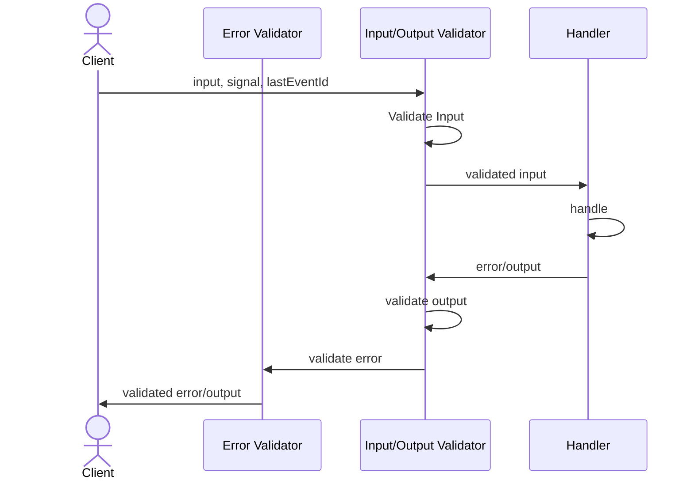

# Server-Side Clients

Call your [procedures](/docs/procedure) in the same environment as your server, no proxies required, like native functions.

## Calling Procedures

### Using `.callable`

```ts
import { os } from '@orpc/server'
import * as z from 'zod'

const getProcedure = os
  .input(z.object({ id: z.string() }))
  .handler(async ({ input }) => ({ id: input.id }))
  .callable({
    context: {} // Initial context if needed
  })

const result = await getProcedure({ id: '123' })
```

### Using the `call` Utility

```ts
import * as z from 'zod'
import { call, os } from '@orpc/server'

const getProcedure = os
  .input(z.object({ id: z.string() }))
  .handler(async ({ input }) => ({ id: input.id }))

const result = await call(getProcedure, { id: '123' }, {
  context: {}
})
```

## Router Client

```ts
import { createRouterClient, os } from '@orpc/server'

const ping = os.handler(() => 'pong')
const pong = os.handler(() => 'ping')

const client = createRouterClient({ ping, pong }, {
  context: {}
})

const result = await client.ping()
```

### Client Context

```ts
interface ClientContext { cache?: boolean }

const ping = os.handler(() => 'pong')
const pong = os.handler(() => 'ping')

const client = createRouterClient({ ping, pong }, {
  context: ({ cache }: ClientContext) => {
    if (cache) return {} // context when cache enabled
    return {} // context when cache disabled
  }
})

const result = await client.ping(undefined, { context: { cache: true } })
```

## Lifecycle



### Middlewares Order

Apply this to ensure all middlewares run after input validation and before output validation:

```ts
const base = os.$config({
  initialInputValidationIndex: Number.NEGATIVE_INFINITY,
  initialOutputValidationIndex: Number.NEGATIVE_INFINITY,
})
```
